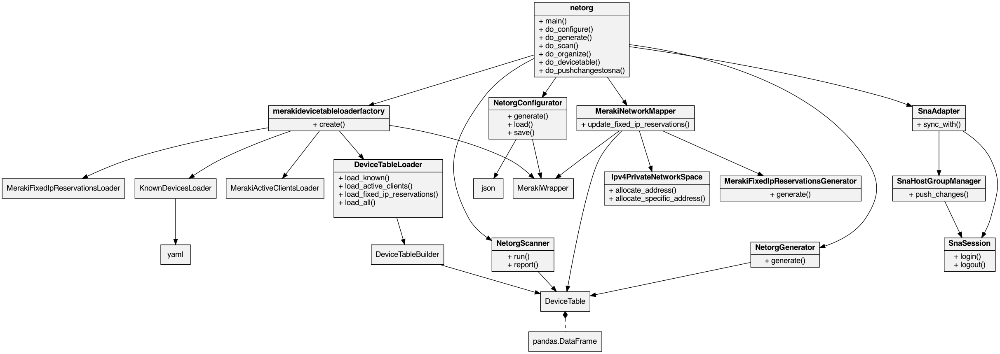

# Net Organizer

Not yet releasable. Still very much under development!

Network Organizer enables you to bring some order to the chaos that might be your network. It is essentially a simple IP Address Manager (IPAM). It enables you to take inventory of active hosts and to neatly classify each of them into groups. It will also manage fixed IP reservations for you. It can convert a dynamic IP or allocate a new fixed IP reservation for known hosts that do not have one. It can clean up lingering fixed IP reservations for unknown and in-active hosts. It can bring to your attention unknown hosts that are active on your network and invite you to classify them. 

Along the way, it avoids network collisions and avoids disruptive re-mapping of the network space.

Once hosts are classifed, you can export the device details for use by other tools - for example, Cisco Secure Network Analytics.

## Usage

The --configure feature is required to get started and is also used if there are changes to the network configuration or API key.
```bash
$ netorg --configure
```

The --generate feature is used to generate the devices.yml file containing known devices. This step can be re-run to update the devices.yml file taking into account any new devices that may have joined the network since the file was generated.
```bash
$ netorg --generate
```

The --scan feature merely analyzes active devices on the network, the known devices in the devices.yml and fixed IP reservations. It reports on what it finds but doesn't take any action.
```bash
$ netorg --scan
```

The --organize feature performs a scan and executes any actions based on the findings from the scan. For example, fixed IP reservations that are no longer needed are removed. New fixed IP reservations are created where necessary. Newly discovered devices are registered in the devices.yml.
```bash
$ netorg --organize
```

## Terminology

A __device__ is a host on the network. A Smart TV or a laptop are examples of devices.

A __device__ is uniquely identified by it's MAC address. Note that MAC randomization has become popular with various devices to enhance privacy. MAC address randomization is an effective way to maintain privacy in public settings, where you don’t know who is looking at your connectivity and location history. But it does create challenges for managing your own network. It is recommended to turn off this feature when connecting to your own managed network, but by all means use the feature when joining public WiFi.

There are 3 primary states for a device. The states are __known__, __active__ and __reserved__ and are described below. Note that these states are NOT mutually exclusive. For example, a device could be __known__ and __active__ but not __reserved__. Therefore, the total number of possible states a device could be in is 7 (2 ^ 3 - 1). 

__Known__ devices are registered in a simple YAML text file. You may classify similar devices under a group - whatever makes sense for your network. Known devices may be unclassified - you can manually classify these later. 

A device can be __active__ on the network. This means it has a current DHCP lease and therefore has an IP address.

A device can be __reserved__ where it has a fixed IP reservation. This means it is granted the same static IP address each time it joins the network. 

## How to get started

### 1. Pre-installation

You will need to obtain a Meraki API key. See the following for details:
https://developer.cisco.com/meraki/api-v1/#!authorization/obtaining-your-meraki-api-key

Record the API key somewhere as you will be prompted for it during subsequent phases of the installation and configuration of netorganizer.

### 2. Installation

This has been developed and tested for Python 3.10.5. Earlier versions may not work. Python 2 will certainly not work. All pip packages are installed in a separate virtual environment (venv). 

Ensure the environment variable $NETORG_HOME is set to the directory where netorganizer is located.

Ensure the PATH includes $NETORG_HOME.

Run the install.sh script as follows:

```shell
$ ./install.sh
```

### 3. Configuration

To get started, you will need to generate a netorg configuration file. It's just a JSON text file that resides in the user's home directory. Rather than create one by hand, you can generate one using the --configure flag as follows:

```text
$ netorg --configure
Configure
You will need to obtain an API key. See the following for details:
https://developer.cisco.com/meraki/api-v1/#!authorization/obtaining-your-meraki-api-key
Meraki API key: 
Multiple networks found:
1 - Nottingham Office
2 - Mobile devices
Which network? : 1
Multiple devices found:
1 - MX68 - Q2KY-XXXX-XXXX
2 - MS120-8LP - Q2BX-XXXX-XXXX
Which device? : 1
Multiple VLANs found:
1 - Default - 192.168.128.0/24
2 - CIMC - 192.168.4.0/24
3 - ENCS - 192.168.5.0/24
Which VLAN? : 1
Directory for where to find/store known devices [/Users/bob]: 
Filename for where to find/store known devices [devices.yml]: 
Saving config file /Users/bob/.netorg.cfg
```

You shouldn't need to reconfigure netorganizer again unless you rotate your Meraki API Key and/or modify your network in anyway (e.g. different network settings, subnets, vlans, devices).

### 4. Generate devices.yml

Known devices are devices that you are aware of on your network. They could be your smart phones, TVs, thermostats, speakers, appliances, tablets and of course laptops and PCs.

To register a known device, you will need to capture the MAC address, provide a name for the device and classify it under a grouping. This is to be stored in a file called devices.yml. The devices.yml has to be valid [YAML](https://yaml.org).

You don't need to write the devices.yml file from scratch. One can be generated for you to get you started based on devices that are currently active. There is no automated classification feature yet, and so it will put all the un-classified active devices it finds under "unclassified". You can classify them later if required.

Here's an example:
```yaml
---
devices:
  unclassified:
    - None,9a:1b:ba:d4:b6:54
    - RingCamMini-11,34:3e:a4:4e:1b:11
    - Craigs-iPhone,6e:d9:36:a9:21:ee
```

You should consider classifying the devices as you see fit by editing the devices.yml file. Below is an example containing classified devices:

```yaml
---
devices:
  servers:
    - Servers Linux,f8:63:3f:19:b5:36
  printers:
    - Printers Office,00:1b:a9:1a:82:d4
    - Printers Basement,64:6c:80:8e:c5:1c
  eero:
    - Eero Beacon Lady Pit,18:90:88:28:eb:5b
    - Eero Beacon Family Room,18:90:88:29:2b:5b
    - Eero Office,f8:bc:0e:01:29:32
    - Eero Beacon Dining Room,30:57:8e:f8:84:bb
  kitchen_appliances:
    - Kitchen Appliances Fridge,68:a4:0e:2d:9a:91
```

A devices.yml file can be generated as follows:

```text
$ netorg --generate
```

It saves off the generated devices.yml in the directory you specified during the configuration.
If a devices.yml already exists, it merely updates it.

### 4. Perform a scan

The scan feature merely analyzes active devices on the network, the known devices in the devices.yml and fixed IP reservations. 

Here is an example:

```text
Did not find any devices that are: not known and not reserved and active
Did not find any devices that are: not known and reserved and not active
Did not find any devices that are: not known and reserved and active
Found 1 device(s) that are: known and not reserved and not active
A reserved IP will be created during the next organize
     None
Found 11 device(s) that are: known and not reserved and active
The current IP will be converted to a static IP during the next organize
     Eero-eero-20:be:cd:ac:37:20
     Jasons Devices work laptop-JASCHAMB-M-XRDP
     Ring downstairs camera-RingCamMini-11
     Ring upstairs camera-RingCamMini-d7
     Smart Lighting Master left-HS105
     Smart Lighting Master right-HS105
     stratford-switch-0c8ddb0403b6
     Kitchen-Aura-6141
     None
     LT6221
     None
Found 13 device(s) that are: known and reserved and not active
These devices are currently inactive - no action will be taken during the next organize
     Servers Linux
     Printers Office
     Jasons Devices iPad
     Jasons Devices Apple Watch
     Roses Devices Apple Watch
     SONOS Mobile
     Samsung TV
     Katies Devices Work laptop
     Katies Devices iPad
     Jimmys Devices iPhone
     ISR 0/0/0 Management Interface
     Jasons Devices work laptop (wired)
     Jasons Devices work laptop
Found 47 device(s) that are: known and reserved and active
Normal state - no action will be taken during the next organize
     Printers Basement
     Eero Beacon Lady Pit
     Eero Beacon Family Room
     Eero Office
     Eero Beacon Dining Room
     Kitchen Appliances Fridge
     Jasons Devices iPhone-11-Pro-Max
     Jasons Devices iMac
     Echos Kitchen Echo Show
     Echos Bar
     Echos Jason Office
     Echos Master Bathroom
     Ring backdoor
     Ring base station
     Ring front camera
     Ring front door
     Roses Devices iPad
     Roses Devices Kindle
     Roses Devices iPhone 2
     Roses Devices iPhone 1
     Roses Devices Work Laptop
     Roses Devices MacBook
     SONOS Bridge
     SONOS Kitchen
     SONOS Office
     SONOS Port HiFi
     SONOS Connect CD
     SONOS Bedroom
     SONOS Lady Pit
     SONOS Sub
     SONOS Den
     SONOS Den LS
     SONOS Den RS
     Thermostat Lower
     Thermostat Upper
     Smart Lighting Roses bed light
     Smart Lighting Jasons bed light
     Smart Lighting Den tall light
     Smart Lighting Kitchen LED
     Smart Lighting Bar Light 1
     Smart Lighting Bar Light 2
     Smart Lighting Jasons Desk Light
     Smart Lighting Office Light
     Apple TVs Den
     Apple TVs K and J room
     Apple TVs Guest Room
     Arlo Camera
Found 3 device(s) that are: active and group == 'unclassified'
You should consider classifying them before the next organize
     None
     LT6221
     None
```

### 5. Organize

Let's now have Network Organizer take some action based on what it finds. 

#### 5.1. A new device joins the network

The most typical scenario will be a new device joining the network. As a new device, it won't have a fixed IP reservation and it will not be known device in the devices.yml file. In this scenario, a new iPad has just joined the network:

```text
$ netorg -o
Organize
Loading config file /Users/jasonchambers/.netorg.cfg
Loading known devices from /Users/jasonchambers/devices.yml
Loading known devices from /Users/jasonchambers/devices.yml
Generating devices.yml file at /Users/jasonchambers/devices.yml
Loading known devices from /Users/jasonchambers/devices.yml
NetorgGenerator: Known devices (devices.yml) differences are as follows:
  Adding devices:
    unclassified: Jasons Devices iPad c2:ae:0b:5c:32:36
Fixed IP reservation differences are as follows:
  Adding reservations:
    192.168.128.169 for device c2:ae:0b:5c:32:36 named Jasons Devices iPad
```

All new devices will be "unclassified". If you do nothing, on the next scan there will be a reminder to classify it:

```text
➜  ~ netorg -s
scan
Loading config file /Users/jasonchambers/.netorg.cfg
Loading known devices from /Users/jasonchambers/devices.yml
.......
Found 1 device(s) that are: active and group == 'unclassified'
You should consider classifying them before the next organize
     Jasons Devices iPad
```

So, let's go ahead and classify it by modifying the devices.yml file in a text editor. We do this by simply moving the line containing the device under the unclassified: section into a more appropriate group:

Before:
```yaml
devices:
  jasons_devices:
    - Jasons Devices iPhone-11-Pro-Max,5e:1e:16:aa:a3:ee
    - Jasons Devices work laptop-JASCHAMB-M-XRDP,f8:4d:89:7d:71:90
    - Jasons Devices iMac,3c:22:fb:a3:a7:90
    - Jasons Devices Apple Watch,6a:0a:75:9c:5d:13
  unclassified:
    - Jasons Devices iPad,c2:ae:0b:5c:32:36
```

After:
```yaml
devices:
  jasons_devices:
    - Jasons Devices iPhone-11-Pro-Max,5e:1e:16:aa:a3:ee
    - Jasons Devices work laptop-JASCHAMB-M-XRDP,f8:4d:89:7d:71:90
    - Jasons Devices iMac,3c:22:fb:a3:a7:90
    - Jasons Devices Apple Watch,6a:0a:75:9c:5d:13
    - Jasons Devices iPad,c2:ae:0b:5c:32:36
```

#### 5.2. Missing fixed IP reservation

Let's assume we have a device that is active on the network. It is a known device, but for whatever reason it is missing a fixed IP reservation. Network Organizer can detect this scenario during a scan:

```text
$ netorg -s
scan
Loading config file /Users/jasonchambers/.netorg.cfg
Loading known devices from /Users/jasonchambers/devices.yml
Did not find any devices that are: not known and not reserved and active
Did not find any devices that are: not known and reserved and not active
Did not find any devices that are: not known and reserved and active
Did not find any devices that are: known and not reserved and not active
Found 1 device(s) that are: known and not reserved and active
The current IP will be converted to a static IP during the next organize
     Jasons Devices iPad
```

Now let's organize:

```text
$ netorg -o
Organize
Loading config file /Users/jasonchambers/.netorg.cfg
Loading known devices from /Users/jasonchambers/devices.yml
Loading known devices from /Users/jasonchambers/devices.yml
Generating devices.yml file at /Users/jasonchambers/devices.yml
Loading known devices from /Users/jasonchambers/devices.yml
NetorgGenerator: There are no changes to known devices (devices.yml)
Fixed IP reservation differences are as follows:
  Adding reservations:
    192.168.128.169 for device c2:ae:0b:5c:32:36 named Jasons Devices iPad
```

#### 5.3. Retired devices

For this scenario, let's assume there is a fixed IP reservation taking up space. The device is not active and it is not a known device captured in the devices.yml. Perhaps it the device is an old piece of equipment you have retired. In this case, we want the reservation to be removed. To test this, a bogus reservation for a device named "Wasteful fixed IP assignment" was created prior to running:

```text
$ netorg -o
Organize
Loading config file /Users/jasonchambers/.netorg.cfg
Loading known devices from /Users/jasonchambers/devices.yml
Loading known devices from /Users/jasonchambers/devices.yml
Generating devices.yml file at /Users/jasonchambers/devices.yml
KnownDevicesGenerator: Skipping Wasteful fixed IP assignment,ce:13:2f:72:24:ff
Loading known devices from /Users/jasonchambers/devices.yml
NetorgGenerator: There are no changes to known devices (devices.yml)
MerakiFixedIpReservationsGenerator: skipping ce:13:2f:72:24:ff
Fixed IP reservation differences are as follows:
  There are no new fixed IP reservations
  Removing reservations:
    192.168.128.222 for device ce:13:2f:72:24:ff named Wasteful fixed IP assignment
```

#### 5.4. New devices that are yet to join the network

For this scenario let's consider a new device. The device in the example is a new Ring camera. The device is not on the network yet so it is not active. It has never been active on the network and so does not have a fixed IP reservation. This is an unusual scenario because you would typically wait for it to join the network, and then run --generate to capture the MAC address and let Network Organizer add it to the devices.yml file, but just for this scenario let's assume the device was manually entered into the devices.yml file:

```text
$ netorg -o
Organize
Loading config file /Users/jasonchambers/.netorg.cfg
Loading known devices from /Users/jasonchambers/devices.yml
Loading known devices from /Users/jasonchambers/devices.yml
Generating devices.yml file at /Users/jasonchambers/devices.yml
Loading known devices from /Users/jasonchambers/devices.yml
NetorgGenerator: There are no changes to known devices (devices.yml)
Fixed IP reservation differences are as follows:
  Adding reservations:
    192.168.128.24 for device ce:13:2f:72:24:ff named A new Ring cam
```

#### 5.5. No new changes on the network

As your network begins to settle down, typically there is no organizing to be done and you will see output like this:

```text
$ netorg -o
Organize
Loading config file /Users/jasonchambers/.netorg.cfg
Loading known devices from /Users/jasonchambers/devices.yml
Loading known devices from /Users/jasonchambers/devices.yml
Generating devices.yml file at /Users/jasonchambers/devices.yml
Loading known devices from /Users/jasonchambers/devices.yml
NetorgGenerator: There are no changes to known devices (devices.yml)
There are no changes to fixed IP reservations
```

# Supports

1. Cisco Meraki powered networks only (for now)
2. IPv4 only (for now)

# Internals

